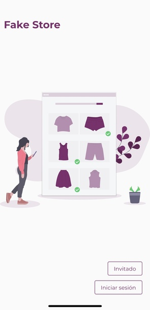
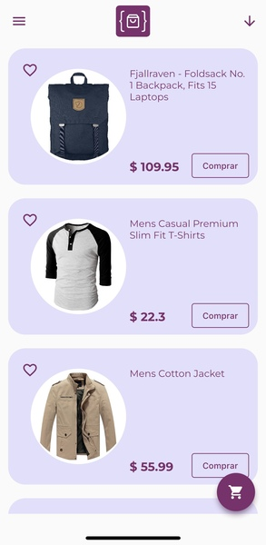
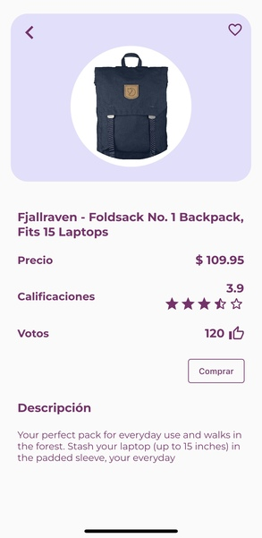

# FakeStoreApi

A Flutter e-commerce app

## OS
1. Android
2. IOS


## Framework and language
1. Flutter 
2. Dart

## Libraries
1. get
2. shared_preferences
3. http
4. modal_progress_hud_nsn
5. cached_network_image
6. flutter_launcher_icons
7. flutter_svg

## API's

https://fakestoreapi.com/

### Get all products
``` javascript
fetch('https://fakestoreapi.com/products')
            .then(res=>res.json())
            .then(json=>console.log(json))
```

### Get a single product
``` javascript
fetch('https://fakestoreapi.com/products/1')
            .then(res=>res.json())
            .then(json=>console.log(json))
```

### Get all categories
``` javascript
fetch('https://fakestoreapi.com/products/category/jewelery')
            .then(res=>res.json())
            .then(json=>console.log(json))
```


## Api 
extract in out the folder see it

## Images






